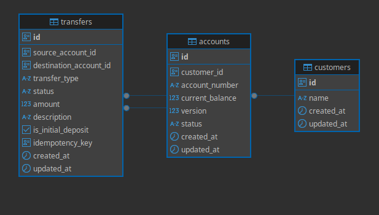
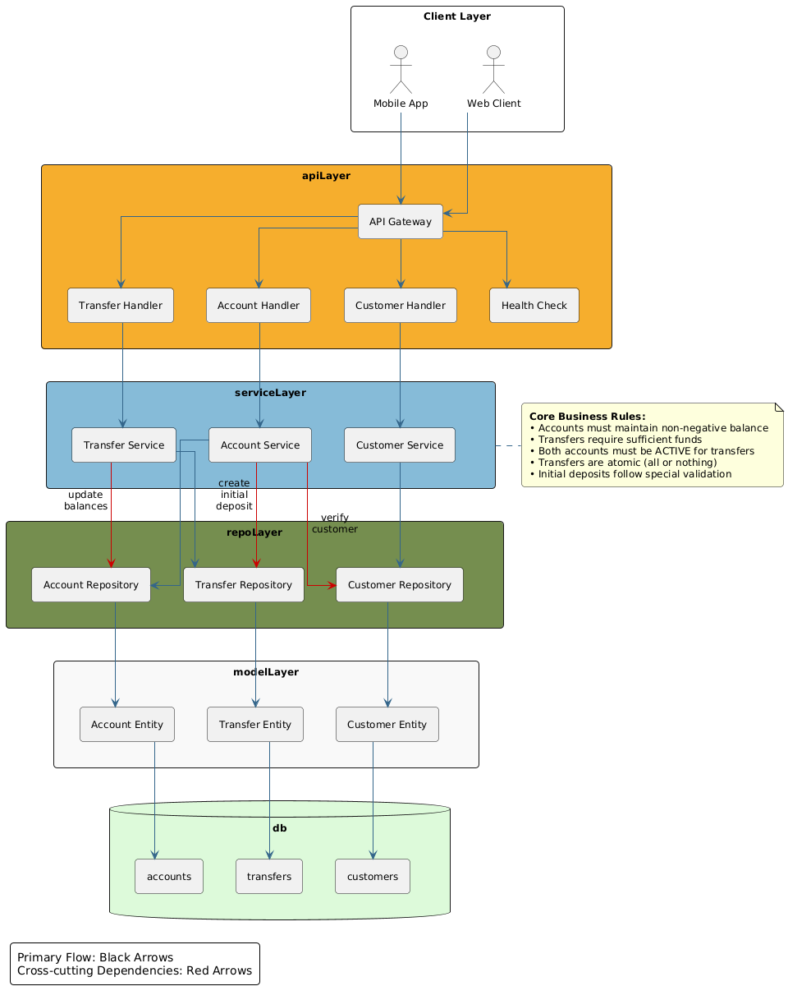
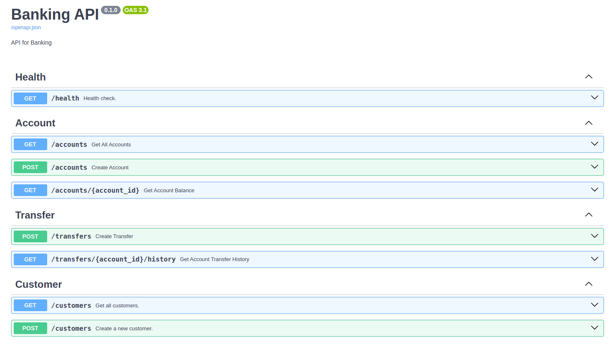

# Banking API

A robust and scalable REST API for a financial institution, providing core banking functionality built with Python and FastAPI.

## Overview

This API serves as the backend for a banking system, enabling account management, money transfers, and transaction history tracking. It's designed with a hexagonal architecture, focusing on separation of concerns, maintainability, and production readiness.

## Features

- **Account Management**
  - Open new bank accounts with an initial deposit
  - Check account balances
  - Associate multiple accounts with a single customer

- **Money Transfers**
  - Transfer funds between accounts (including across different customers)
  - Ensure transactional integrity and proper error handling
  - Support for idempotent transfers to prevent duplicate transactions

- **Transaction History**
  - Retrieve complete transfer history for any account
  - Track transfer status and metadata

## Technical Design

### Database Design

The database schema includes the following core entities:

- **Customers** - Basic customer information
- **Accounts** - Bank accounts with current balances
- **Transfers** - Records of money movements between accounts

#### Entity Relationship Diagram



### Architecture

The project follows a layered architecture with clear separation of concerns:

- **API Layer** - REST endpoints for client interaction
- **Service Layer** - Business logic and orchestration
- **Repository Layer** - Data access and persistence
- **Model Layer** - Domain entities and data structures

#### System Design



### Key Design Decisions

1. **Optimistic Concurrency Control** - Used to handle simultaneous account balance updates safely using a version counter
2. **Transactional Integrity** - All money transfers are atomic operations
3. **Idempotency** - Implemented using unique idempotency keys for safe retry operations
4. **Type Safety** - Utilized Python type hints throughout for better code quality and developer experience

## Getting Started

### Prerequisites

Before you begin, ensure you have the following installed on your system:

- **Docker**
- **Docker Compose**

Make sure to verify the installation of these tools by running the following commands:

```bash
docker --version
docker-compose --version
```

### Installation

1. Clone the repository:

   ```bash
   git clone https://github.com/manoja-HA/nexus-banking-platform
   cd nexus-banking-platform/banking_api
   ```

2. Run the application with docker:

    ```bash
    docker-compose up -d
    ```

## API Documentation

Once the server is running, access the Swagger API documentation at:

```
http://localhost:8080/docs
```



### Core Endpoints

#### Accounts

- `POST /accounts` - Create a new account
- `GET /accounts/{account_id}` - Get account balance
- `GET /accounts` - List all accounts

#### Transfers

- `POST /transfers` - Create a new transfer
- `GET /accounts/{account_id}/history` - Get transfer history for an account

#### Customers

- `POST /customers` - Creat a new customer
- `GET /customers` - List all customers

## Testing

The project includes comprehensive unit tests. Before running the test suite, ensure you set up a virtual environment and install dependencies using Poetry:

1. Create a virtual environment in the root folder:

  ```bash
  python3 -m venv .venv
  ```

2. Activate the virtual environment:

- On Linux/macOS:

    ```bash
    source .venv/bin/activate
    ```

- On Windows:

    ```bash
    .venv\Scripts\activate
    ```

3. Install dependencies using Poetry:

  ```bash
  cd banking_api
  poetry install
  ```

4. Run the test suite:

  ```bash
  cd src
  pytest
  ```

## Future Development Roadmap

The Banking API has a clear path to production with the following planned improvements:

### 1. Security Enhancements

- Authentication and authorization implementation
- Data encryption for sensitive information
- API rate limiting
- Input sanitization beyond basic validation

### 2. Scalability Considerations

- Connection pooling
- Caching strategy
- Horizontal scaling approach

### 3. Operational Excellence

- Logging and monitoring setup
- CI/CD pipeline
- Backup and disaster recovery plans

### 4. Financial System Requirements

- Audit logging for all financial operations
- Compliance with financial regulations

### 5. Enhanced Architecture

- Asynchronous processing for notifications
- Event sourcing for financial transactions
- Microservices evolution path to event-driven architecture
